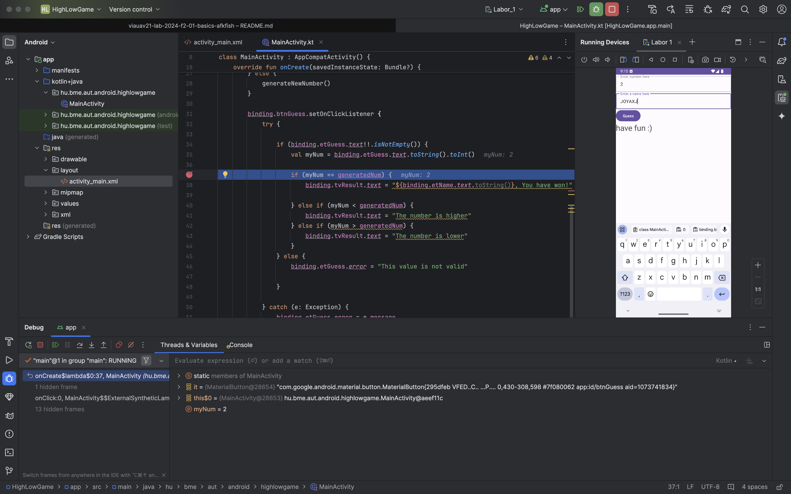
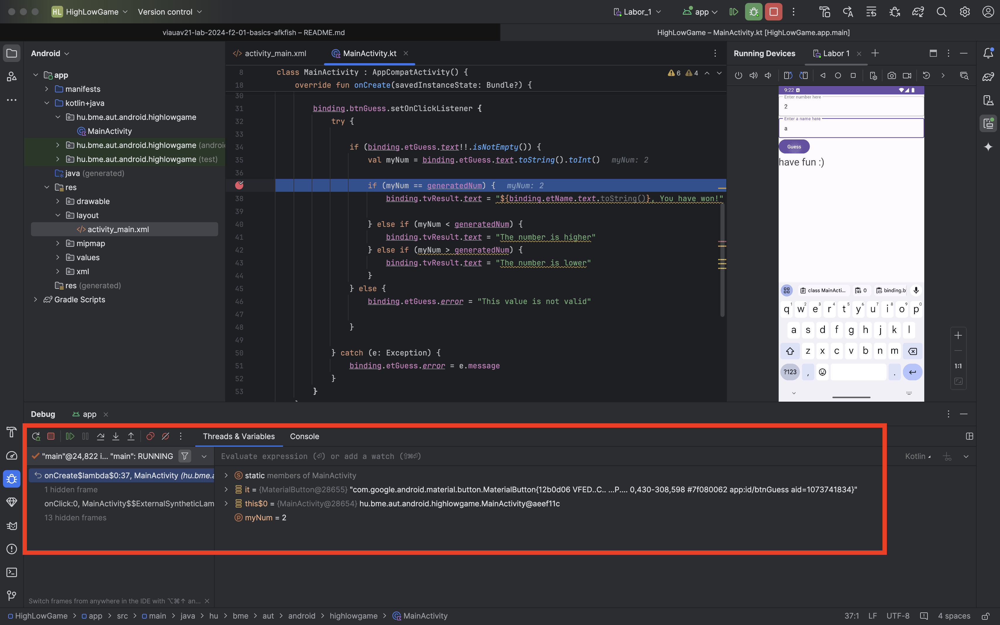

# Android01 labor - HighLowGame

## Feladat 1

Magyarázat: Rá kellett nyomni a 'Run' gombra, a build után az alkalmazás feltelepült az emulátorra és el is indult.

## Feladat 2

Magyarázat: Az alkalmazás megállt a beállított breakpoint-nál, mikor a gombra kattintottam.

## Feladat 3

Magyarázat: Az emulátor eszközeivel felhívtam és sms-t küldtem az emulátorra.

## Feladat 4

Magyarázat: Az emulátorról felhívtam egy számot ami azonnal meg is híusult és sms-t küldtem.

## Feladat 5

Magyarázat: Megnyitottam a profilert és a 'Start Recording' gombra kattintottam, majd a 'Stop Recording' gombra. Itt láthatóak voltak az alkalmazás futás közbeni teljesítmény profilja.

## Feladat 6

Magyarázat: Átállítottam a GPS pozíciót a 'Location' menüpontban és ez látszott a térképen is.

## Feladat 7

Magyarázat: Megnéztem a futás közbeni memória foglalásokat és a nyitott szálakat a debug menüben.

## Feladat 8

Magyarázat: Megnéztem a logokat a 'Logcat' menüpontban.

## Feladat 9

Magyarázat: Az inspect code eredményeit néztem meg, amiben rengeteg figyelmeztetés volt de volt egy kettő hiba is amit érzékelt.

## Feladat 10

Magyarázat: Ahoz hogy APK generálódjon, a build menüben kellett megtalálni a megfelelő opciót. Ezután a `build/outputs/apk/debug` mappában található az APK fájl. Ezt kicsomagoltam és megnéztem a tartalmát az android studióban amivel kiderült hogy a projekt felhasználói jelen esetben a `classes2.dex` fileban voltak.